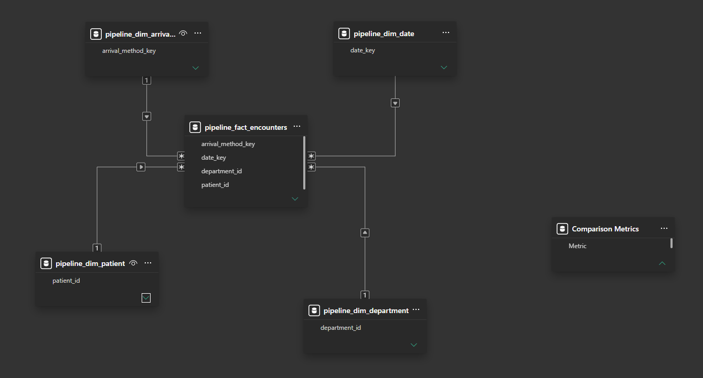
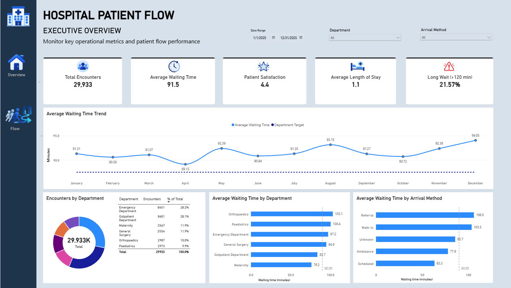
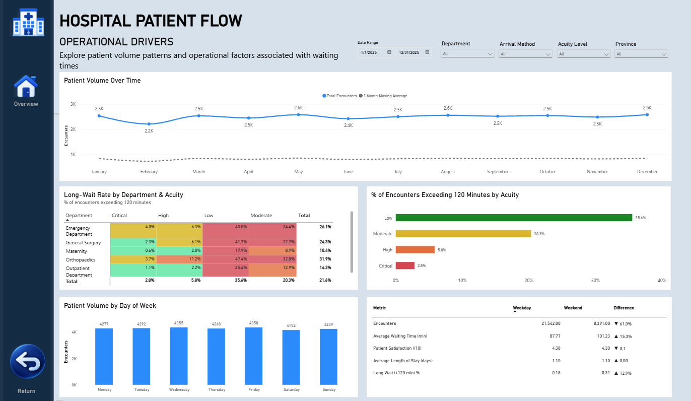

# 🏥 Hospital Patient Flow & Waiting Time Analytics

An end-to-end **Data Engineering and Business Intelligence project** analysing hospital patient flow, waiting-time performance and operational patterns across **29,933 patient encounters**.

The project takes hospital encounter data through a **Bronze → Silver → Gold** data architecture using SQL and Databricks, then connects the validated Gold layer to a Power BI semantic model and interactive dashboard.

The objective is not simply to report hospital KPIs, but to investigate **where waiting-time pressure occurs, how it varies across patient and operational characteristics, and what patterns may require further investigation.**

> **Note:** The dataset combines generated hospital data with an open-source dataset and is used for portfolio and interview purposes. It does not represent a production hospital system or real patient records.

---

# 📌 Business Problem

Patient waiting time is an important operational indicator in a hospital environment. Looking only at an overall average can hide differences between departments, acuity levels, arrival methods and periods of higher patient demand.

This project focuses on understanding:

- How patient volume changes over time
- Which departments experience higher waiting times
- How waiting time varies by patient acuity
- How frequently patients wait longer than 120 minutes
- Whether waiting-time patterns differ between weekdays and weekends
- Whether higher patient volumes are associated with longer waiting times
- How waiting-time performance differs by arrival method
- How waiting time relates to other operational measures such as length of stay and patient satisfaction

The final dashboard is designed to move from **high-level performance monitoring** into **deeper operational analysis**.

---

# 🏗️ End-to-End Architecture

```text
                         SOURCE DATA
                             │
                             ▼
                    ┌─────────────────┐
                    │     BRONZE      │
                    │ Raw source data │
                    └────────┬────────┘
                             │
                             ▼
                    ┌─────────────────┐
                    │     SILVER      │
                    │ Cleaning +      │
                    │ validation      │
                    │ + quarantine    │
                    └────────┬────────┘
                             │
                             ▼
                    ┌─────────────────┐
                    │      GOLD       │
                    │ Star schema     │
                    │ Fact +          │
                    │ dimensions      │
                    └────────┬────────┘
                             │
                             ▼
                    ┌─────────────────┐
                    │    POWER BI     │
                    │ Semantic Model  │
                    │ + DAX           │
                    │ + Dashboard     │
                    └─────────────────┘
```

The data engineering pipeline was initially developed and validated using **SQL Server** and subsequently implemented in **Databricks using Lakeflow** for pipeline orchestration and dependency management.

---

# 📂 Source Data

The project uses hospital-related encounter data combining **generated data with an open-source dataset**.

The analytical dataset contains:

**29,933 clean patient encounters**

The original Bronze encounter dataset contains:

**30,035 records**

After data-quality processing:

```text
30,035 Bronze encounters
        │
        ├── 29,933 clean encounters
        │
        └──    102 quarantined records
```

### Source datasets

| Dataset | Description |
|---|---|
| `dim_patients.csv` | Patient demographic and funding information |
| `dim_departments.csv` | Hospital department reference data |
| `fact_encounters_dirty.csv` | Encounter-level hospital data containing data-quality issues |

**Fact grain:** one row represents one hospital encounter.

---

# 🥉 Bronze Layer

The Bronze layer preserves the source data as closely as possible while providing the starting point for downstream processing.

### Bronze tables

```text
bronze.patients_raw
bronze.departments_raw
bronze.encounters_raw
```

### Purpose

The Bronze layer is responsible for:

- Loading the source data
- Preserving source values
- Checking ingestion and row counts
- Profiling data-quality issues
- Providing a reliable source for downstream transformations

The main business transformations are intentionally performed in the Silver and Gold layers rather than directly against the raw data.

### Bronze encounter count

**30,035 records**

---

# 🥈 Silver Layer

The Silver layer is the primary **cleaning, validation and data-quality layer**.

### Key transformations

- Data-type conversion
- Text standardisation
- Trimming unnecessary spaces
- Duplicate detection
- Duplicate handling
- Missing-value handling
- Waiting-time validation
- Date conversion
- Derived fields
- Weekend/day-type classification
- Wait-band creation
- Data-quality quarantine

### Silver datasets

```text
silver.pipeline_patients
silver.pipeline_departments
silver.pipeline_encounters
silver.pipeline_encounters_quarantine
```

### Final Silver results

| Dataset | Records |
|---|---:|
| Patients | 12,000 |
| Departments | 6 |
| Clean encounters | 29,933 |
| Quarantine | 102 |

### Reconciliation

```text
29,933 clean encounters
+   102 quarantined records
-------------------------
30,035 Bronze records
```

This reconciliation confirms that the original encounter population is accounted for after data-quality processing.

Invalid and duplicate records are retained in quarantine rather than silently removed.

---

# 🥇 Gold Layer

The Gold layer is the **business-ready analytical layer**.

A star-schema structure was created with the encounter fact table at the centre and supporting dimensions surrounding it.

### Gold datasets

```text
gold.pipeline_fact_encounters

gold.pipeline_dim_patient
gold.pipeline_dim_department
gold.pipeline_dim_arrival_method
gold.pipeline_dim_date
```

### Gold results

| Dataset | Records |
|---|---:|
| Patient dimension | 12,000 |
| Department dimension | 6 |
| Arrival method dimension | 5 |
| Date dimension | 365 |
| Encounter fact | 29,933 |

The arrival-method dimension includes an **Unknown** member with key `0`, allowing missing arrival methods to remain represented in the fact table while maintaining a valid dimension relationship.

---

# 🧱 Data Model

The Power BI semantic model uses the Gold-layer fact and dimension tables.

### Central fact table

`pipeline_fact_encounters`

Contains encounter-level information used for the analytical calculations.

### Dimensions

- `pipeline_dim_date`
- `pipeline_dim_patient`
- `pipeline_dim_department`
- `pipeline_dim_arrival_method`

The model follows a dimensional/star-schema approach to support flexible analysis across time, patient characteristics, departments and arrival methods.

### Power BI Data Model



---

# ☁️ Databricks & Lakeflow

The validated SQL transformations were implemented in **Databricks**.

**Lakeflow** was used to orchestrate the Silver and Gold transformations and represent dataset dependencies.

Examples of pipeline dependencies include:

```text
pipeline_patients
       ↓
pipeline_dim_patient
```

and:

```text
pipeline_encounters
       ├──────────────► pipeline_fact_encounters
       │
       ▼
pipeline_dim_arrival_method
```

The pipeline was successfully executed and the resulting datasets were validated against the expected data model.

### Final pipeline validation

| Dataset | Result |
|---|---:|
| `silver.pipeline_patients` | 12,000 |
| `silver.pipeline_departments` | 6 |
| `silver.pipeline_encounters` | 29,933 |
| `silver.pipeline_encounters_quarantine` | 102 |
| `gold.pipeline_dim_patient` | 12,000 |
| `gold.pipeline_dim_department` | 6 |
| `gold.pipeline_dim_arrival_method` | 5 |
| `gold.pipeline_dim_date` | 365 |
| `gold.pipeline_fact_encounters` | 29,933 |

The output counts matched the validated data model.

Pipeline diagrams and Databricks documentation are available under:

```text
databricks/diagrams/
databricks/docs/
```

---

# 🔎 Data Quality Decisions

Data-quality issues were intentionally handled rather than hidden from the downstream analytical model.

## Duplicate Encounters

Duplicate `encounter_id` values were identified using `ROW_NUMBER()`.

One valid record is retained while additional duplicate copies are moved into quarantine.

## Invalid Waiting Times

Waiting times outside the accepted **0–720 minute range** are treated as invalid for the clean encounter dataset.

## Missing Arrival Methods

Missing arrival methods are represented using:

```text
arrival_method_key = 0
arrival_method = Unknown
```

This allows the encounter to remain in the fact table while maintaining referential integrity with the arrival-method dimension.

The arrival-method dimension therefore contains:

```text
0 = Unknown
1 = Ambulance
2 = Referral
3 = Scheduled
4 = Walk-in
```

---

# 📊 Power BI Dashboard

The Gold layer is consumed by Power BI to provide an interactive analytical view of hospital patient flow and waiting-time performance.

The report contains **two pages**, intentionally separating executive-level information from deeper operational analysis.

---

## 1. Executive Overview

The first page provides a high-level view of hospital performance.

The page focuses on questions such as:

- How many patient encounters are being handled?
- What is the average waiting time?
- How is waiting-time performance changing over time?
- Which departments experience higher waiting times?
- How do arrival methods differ?
- What proportion of patients experience long waits?
- How does overall performance compare against the waiting-time target?



---

## 2. Patient Flow & Operational Drivers

The second page moves deeper into the operational factors surrounding patient waiting time.

The analysis includes:

- Patient volume over time
- Three-month moving average
- Patient volume by day of week
- Patient volume versus average waiting time
- Waiting time by acuity
- Long-wait rate by acuity
- Long-wait rate by department and acuity
- Weekday versus weekend performance
- Waiting-time differences across operational categories

The page is designed to answer:

> **Where are the operational patterns behind patient waiting times, and which areas may require further investigation?**



---

# 📐 Power BI Analysis

The Power BI model uses DAX measures and calculated columns to support the analytical layer.

Key calculations include:

- Total encounters
- Average waiting time
- Long-wait rate
- Average length of stay
- Patient satisfaction
- Patient volume
- Moving averages
- Weekday/weekend comparisons
- Acuity-level analysis
- Department-level analysis

A **120-minute threshold** is used to identify long waits.

A **three-month moving average** provides additional context around patient-volume trends by smoothing short-term fluctuations.

A custom weekday-number column was created to ensure that day-of-week analysis is displayed chronologically:

```text
Monday → Tuesday → Wednesday → Thursday → Friday → Saturday → Sunday
```

The Power BI report also includes:

- Interactive filtering
- Conditional formatting
- Custom sorting
- Page navigation
- Comparison analysis
- Business-focused visual design

---

# 🔎 Key Analytical Insights

The dashboard is designed to identify patterns rather than simply display individual KPIs.

### Patient Volume and Waiting Time

The analysis indicates a **positive relationship between patient volume and average waiting time** within the dataset, providing a starting point for investigating capacity and demand pressure.

### Long Waits

The 120-minute threshold provides a more focused operational measure than average waiting time alone.

The department × acuity analysis allows areas with higher long-wait rates to be identified for further investigation.

### Day-of-Week Patterns

Patient volume remains relatively consistent across the week, with differences between individual days that can be explored alongside waiting-time performance.

### Weekday vs Weekend

The comparison analysis evaluates differences in:

- Patient encounters
- Average waiting time
- Long-wait rate
- Length of stay
- Patient satisfaction

This provides a more detailed view of operational performance than an overall hospital average.

> These observations describe patterns within the dataset. They should not be interpreted as proof of causation.

---

# 🛠️ Technology Stack

### Data Engineering

- SQL
- SQL Server
- Databricks
- Lakeflow
- Delta tables
- Medallion architecture
- Dimensional modelling
- Star schema

### Data Quality

- Data profiling
- Duplicate detection
- Null handling
- Data-type validation
- Business-rule validation
- Quarantine handling
- Reconciliation checks

### Business Intelligence

- Power BI
- DAX
- Power Query
- Semantic modelling
- Time-series analysis
- Conditional formatting
- Interactive dashboard development

### Development & Documentation

- Git
- GitHub
- Draw.io
- Markdown

---

# 📁 Repository Structure

```text
hospital-patient-flow-analytics/
│
├── data/
│   └── raw/
│
├── databricks/
│   ├── diagrams/
│   ├── docs/
│   └── sql/
│
├── diagrams/
│
├── docs/
│
├── powerbi/
│   ├── Hospital Patient Flow.pbix
│   │
│   ├── screenshots/
│   │   ├── executive-overview.png
│   │   └── patient-flow-operations.png
│   │
│   └── documentation/
│       └── data-model.png
│
├── sql/
│   ├── bronze/
│   ├── silver/
│   └── gold/
│
└── README.md
```

---

# 🎯 Project Outcome

This project demonstrates an end-to-end workflow from **raw data to business insight**:

```text
Source Data
    ↓
Bronze
    ↓
Data Quality Investigation
    ↓
Silver
    ↓
Quarantine
    ↓
Gold Star Schema
    ↓
Databricks / Lakeflow
    ↓
Validated Analytical Model
    ↓
Power BI Semantic Model
    ↓
Interactive Dashboard
    ↓
Business Insights
```

The project demonstrates practical experience in:

- Designing a layered data architecture
- Developing SQL transformations
- Building data-quality controls
- Handling duplicates and invalid records
- Implementing quarantine processes
- Building fact and dimension tables
- Designing a star schema
- Developing Databricks pipelines
- Working with pipeline dependencies
- Validating data across pipeline layers
- Developing DAX measures
- Building Power BI semantic models
- Performing operational analysis
- Translating business questions into analytical visuals
- Documenting technical decisions
- Using Git and GitHub for version control

---

# 🚀 Future Improvements

If this solution were implemented in a real-world hospital environment, the next stage would be to make the pipeline **production-ready and sustainable as new data arrives**.

Potential improvements would include:

- **Incremental processing** so new patient encounters can be added without reprocessing the entire dataset
- **Pipeline performance optimisation** as data volumes increase
- **Automated data-quality checks** for incoming records
- **Pipeline monitoring** for failures and processing times
- **Automated Power BI refreshes** so the dashboard reflects the latest available data
- **Scalability improvements** as the volume and frequency of incoming data increases

The main consideration would be moving from a validated portfolio pipeline to a solution that can be **maintained reliably as new data continuously enters the system**.

---

# 👩‍💻 Author

**Michaela de Bruyn**

Data Engineering | Data Analytics | Business Intelligence | Cloud

